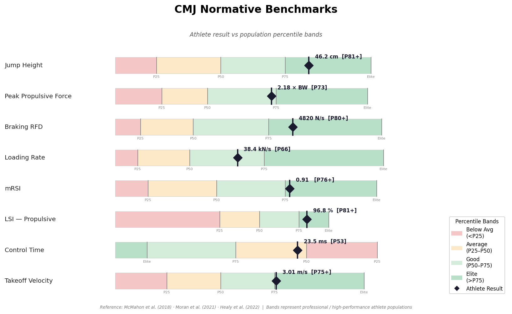
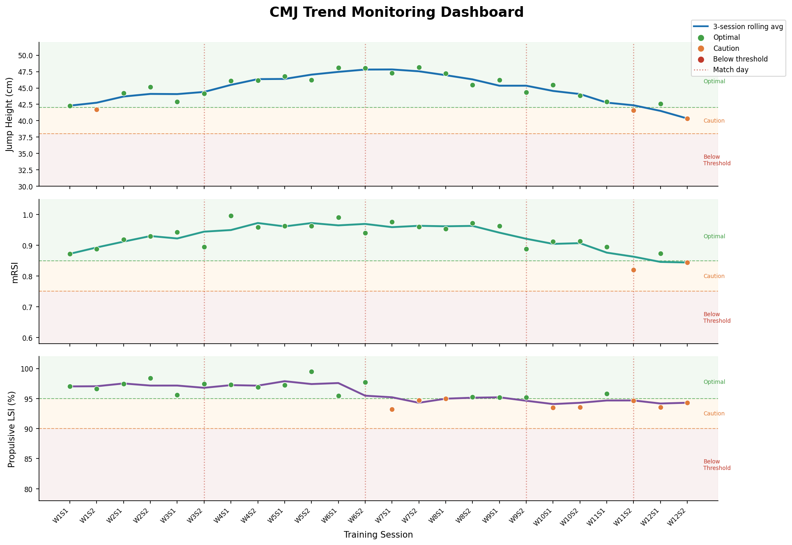

# CMJ Force-Time Curve — Phase Guide

A visual reference for the key phases of the **Countermovement Jump (CMJ)** force-time curve, including jump and landing mechanics.

---

## Jump Phases

### Quiet Phase

| Description | Force-Time Curve |
|---|---|
| The first phase of the CMJ. The athlete stands still for at least **1 second** before movement begins. During this period **system weight** (body weight in Newtons) is calculated. It is important to cue the athlete to stand still to keep the validity of the weighing period high. |  |

---

### Unweighting Phase

| Description | Force-Time Curve |
|---|---|
| The athlete begins the countermovement by **relaxing the agonist muscles**, resulting in combined flexion of the hips and knees. Force drops **below system weight** — the athlete is essentially in free fall. This phase is defined by a **negative velocity** that is continuing to descend (increasing velocity in the negative direction). |  |

---

### Braking Phase

| Description | Force-Time Curve |
|---|---|
| The athlete decelerates ("brakes") their **center-of-mass (COM)**. Braking begins when COM velocity is still negative but ascending toward **0 m/s**. The athlete continues to apply force to decelerate their mass — visually still moving downwards. This phase commences from **peak negative COM velocity** through to when COM velocity increases to zero. |  |

---

### Transfer Point

| Description | Force-Time Curve |
|---|---|
| Also called the **switch phase**, this occurs between the braking and propulsive phases. It can be thought of as the **amortization period** — the brief isometric portion when velocity is zero. This is the lowest portion of the CMJ (minimum displacement). An athlete who spends **less time at the bottom** of the "V" is more efficient at transferring momentum. |  |

---

### Propulsive Phase

| Description | Force-Time Curve |
|---|---|
| The athlete forcefully extends hips, knees, and ankles to **propel their COM vertically**. This phase begins when a **positive COM velocity** is achieved (threshold: 0.01 m/s). Key metrics include average/peak relative propulsive force and average/peak propulsive power **(PRPP)**. If an athlete struggles here, Cleans, Trap Bar Jumps, or Pin Squats may help. |  |

---

### Flight Phase

| Description | Force-Time Curve |
|---|---|
| The athlete leaves the force plates from **take-off** until **touchdown**. Flight time is the outcome of every muscle action and generation of momentum. Note: **Jump Height is calculated using takeoff velocity** (industry gold standard), not flight time. |  |

---

### Landing Phase

| Description | Force-Time Curve |
|---|---|
| The final CMJ phase. Begins when the athlete **contacts the force plate** after the flight phase. The athlete applies a net impulse equal to the propulsion impulse to decelerate COM from contact velocity through to zero. Bilateral force plates can show discrepancies between limbs — key for **return-to-play** and **injury risk** assessment. |  |

---

## Landing Phases — Detail

The CMJ landing curve is subdivided into three distinct phases based on COM velocity and GRF landmarks.

### Full Phase Summary

---

### Phase 1: Loading

| Description | Force-Time Curve |
|---|---|
| From **initial contact** to **peak GRF**. The loading rate and peak force reflect how rapidly and forcefully the athlete accepts ground contact. A higher loading rate can increase injury risk. Key metrics: **Peak GRF**, **Loading Rate**, **v at contact**. |  |

---

### Phase 2: Attenuation

| Description | Force-Time Curve |
|---|---|
| From **peak GRF** to the **local minimum**. The athlete is absorbing and attenuating the impact force. The force attenuation rate and average force during this window indicate how efficiently the athlete disperses impact energy through eccentric muscle action. |  |

---

### Phase 3: Control

| Description | Force-Time Curve |
|---|---|
| From the **local minimum** to when **COM velocity = 0** (COM stops). This brief phase reflects the athlete's ability to stabilize after the main impact is absorbed. Key metrics: **Control Time**, **mRSI**, **LPI**. Shorter control time = greater efficiency. |  |

---

> **Reference:** McMahon, J. J., Suchomel, T. J., Lake, J. P., & Comfort, P. (2018). Understanding the Key Phases of the Countermovement Jump Force-Time Curve. *Strength & Conditioning Journal, 40*(4), 96–106. https://doi.org/10.1519/ssc.0000000000000375

---

## Normative Benchmarks

Athlete results are most meaningful when compared against **population-level percentile bands**. The chart below places key CMJ phase metrics into context — inspired by the benchmark dashboard approach used in sport data science workflows (e.g., [Stats One](https://stats-one.com/)).

### Reference Percentiles (Professional / High-Performance Athletes)

| Metric | Phase | P25 | P50 | P75 | Elite (>P75) |
|---|---|---|---|---|---|
| Jump Height | Flight | 32 cm | 38 cm | 44 cm | > 52 cm |
| Peak Propulsive Force | Propulsive | 1.7× BW | 1.9× BW | 2.2× BW | > 2.6× BW |
| Braking RFD | Braking | 2800 N/s | 3500 N/s | 4500 N/s | > 6000 N/s |
| Loading Rate | Landing Ph1 | 25 kN/s | 32 kN/s | 42 kN/s | > 58 kN/s |
| mRSI | Landing Ph3 | 0.60 | 0.75 | 0.90 | > 1.10 |
| Propulsive LSI | Propulsive | 88% | 92% | 96% | > 99% |
| Control Time | Landing Ph3 | 28 ms | 24 ms | 20 ms | < 15 ms |
| Takeoff Velocity | Propulsive | 2.4 m/s | 2.7 m/s | 3.0 m/s | > 3.5 m/s |

> Values from McMahon et al. (2018), Moran et al. (2021), Healy et al. (2022). Bands represent professional / high-performance populations.

---

## CMJ as a Monitoring Tool

The CMJ force-time curve is not just a one-off assessment — it is one of the most sensitive, non-invasive markers of **neuromuscular readiness** available to performance staff. The workflow below shows how each phase maps to monitoring decisions.

### Multi-Metric Trend Monitoring

Tracking **Jump Height**, **mRSI**, and **Limb Symmetry Index (LSI)** across a training block reveals fatigue accumulation, adaptation, and asymmetry trends — mirroring the Session Report and Weekly Load dashboard approach used in sport analytics workflows.

### Phase → Decision Map

| CMJ Phase | Key Metric | Monitoring Signal | Intervention |
|---|---|---|---|
| **Unweighting** | Unweighting Impulse | Low = reduced eccentric willingness | Reduce high-intensity volume |
| **Braking** | Braking RFD | Drop >10% from baseline = neural fatigue | De-load or active recovery |
| **Propulsive** | Peak Power / Jump Height | Consistent drop = accumulated fatigue | Review load, sleep, nutrition |
| **Propulsive** | Propulsive LSI | <90% = limb asymmetry concern | Unilateral work, physio review |
| **Landing Ph3** | mRSI | <0.75 = poor reactive ability | Reduce plyometric intensity |
| **Landing Ph3** | Control Time | Increasing = loss of landing control | Deceleration and landing mechanics |

### Traffic-Light Thresholds

| Metric | Optimal | Caution | Concern |
|---|---|---|---|
| Jump Height | ≥ P50 for athlete | 5–10% below baseline | > 10% below baseline |
| mRSI | ≥ 0.85 | 0.75 – 0.85 | < 0.75 |
| Propulsive LSI | ≥ 95% | 90 – 94% | < 90% |
| Braking RFD | ≥ P50 for athlete | 5–15% below baseline | > 15% below baseline |

> These thresholds align with the **traffic-light monitoring framework** used in high-performance sport settings. Baselines should be established over ≥ 3 familiarisation sessions before applying cut-offs.

### Integration with Load Monitoring

CMJ metrics are most powerful when combined with **session load (AU), wellness scores, and ACWR** data:

- **Jump Height ↓ + High ACWR** → overreaching risk, reduce load
- **mRSI ↓ + Low Wellness** → systemic fatigue, prioritise recovery
- **LSI < 90% + Return-to-Play context** → not cleared for full training
- **All metrics stable across 3+ sessions** → athlete is adapting well

---

## References

- McMahon, J. J., Suchomel, T. J., Lake, J. P., & Comfort, P. (2018). Understanding the Key Phases of the Countermovement Jump Force-Time Curve. *Strength & Conditioning Journal, 40*(4), 96–106.
- Moran, J., et al. (2021). Normative data for countermovement jump variables in youth and adult athletes.
- Healy, R., et al. (2022). Countermovement jump variables and their relationship to performance characteristics in elite athletes.
- Gathercole, R., et al. (2015). Alternative countermovement-jump analysis to quantify acute neuromuscular fatigue. *International Journal of Sports Physiology and Performance, 10*(1), 84–92.
