# CMJ Force-Time Curve — Phase Guide

A visual reference for the key phases of the **Countermovement Jump (CMJ)** force-time curve, including jump and landing mechanics.

---

## Jump Phases

### Quiet Phase

| Description | Force-Time Curve |
|---|---|
| The first phase of the CMJ. The athlete stands still for at least **1 second** before movement begins. During this period **system weight** (body weight in Newtons) is calculated. It is important to cue the athlete to stand still to keep the validity of the weighing period high. | 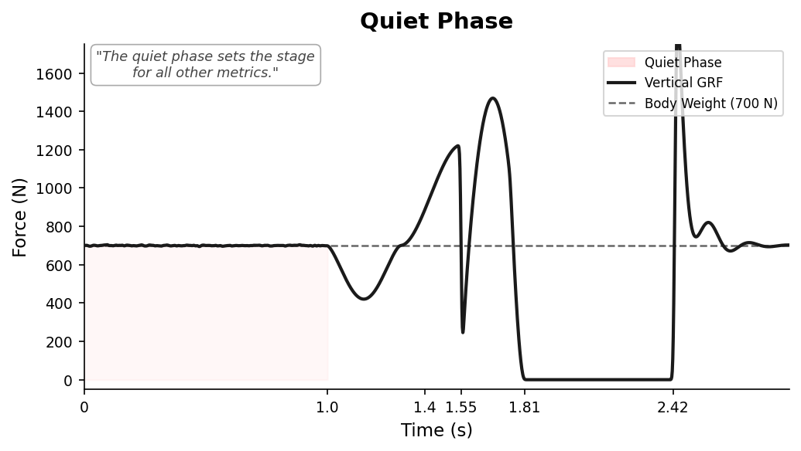 |

---

### Unweighting Phase

| Description | Force-Time Curve |
|---|---|
| The athlete begins the countermovement by **relaxing the agonist muscles**, resulting in combined flexion of the hips and knees. Force drops **below system weight** — the athlete is essentially in free fall. This phase is defined by a **negative velocity** that is continuing to descend (increasing velocity in the negative direction). | 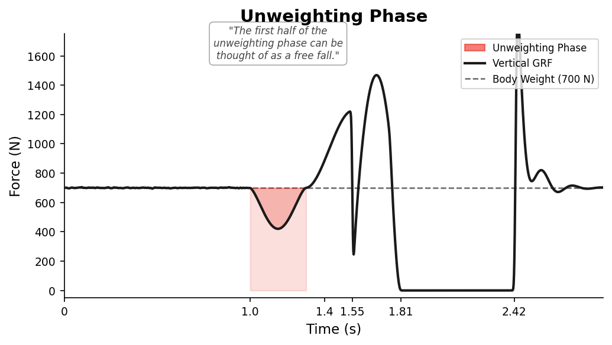 |

---

### Braking Phase

| Description | Force-Time Curve |
|---|---|
| The athlete decelerates ("brakes") their **center-of-mass (COM)**. Braking begins when COM velocity is still negative but ascending toward **0 m/s**. The athlete continues to apply force to decelerate their mass — visually still moving downwards. This phase commences from **peak negative COM velocity** through to when COM velocity increases to zero. | 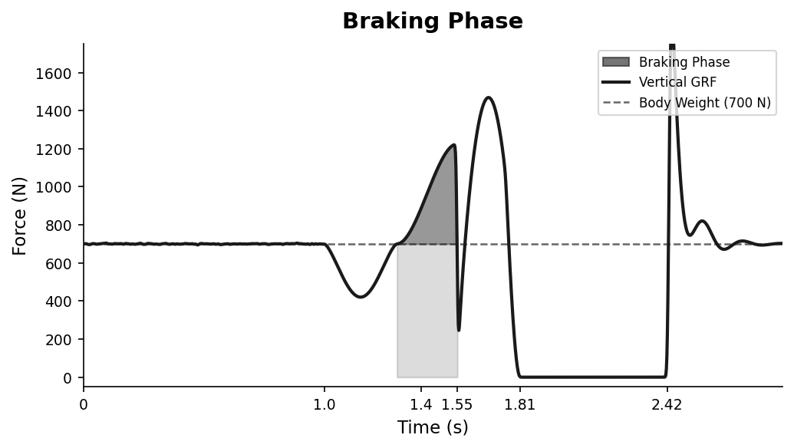 |

---

### Transfer Point

| Description | Force-Time Curve |
|---|---|
| Also called the **switch phase**, this occurs between the braking and propulsive phases. It can be thought of as the **amortization period** — the brief isometric portion when velocity is zero. This is the lowest portion of the CMJ (minimum displacement). An athlete who spends **less time at the bottom** of the "V" is more efficient at transferring momentum. | 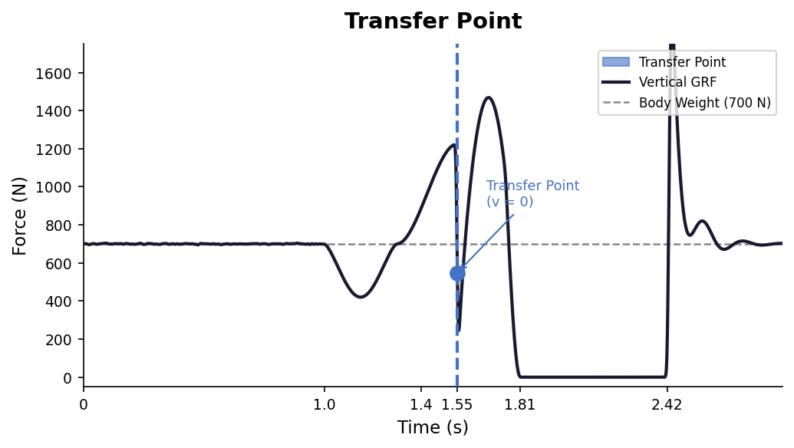 |

---

### Propulsive Phase

| Description | Force-Time Curve |
|---|---|
| The athlete forcefully extends hips, knees, and ankles to **propel their COM vertically**. This phase begins when a **positive COM velocity** is achieved (threshold: 0.01 m/s). Key metrics include average/peak relative propulsive force and average/peak propulsive power **(PRPP)**. If an athlete struggles here, Cleans, Trap Bar Jumps, or Pin Squats may help. | 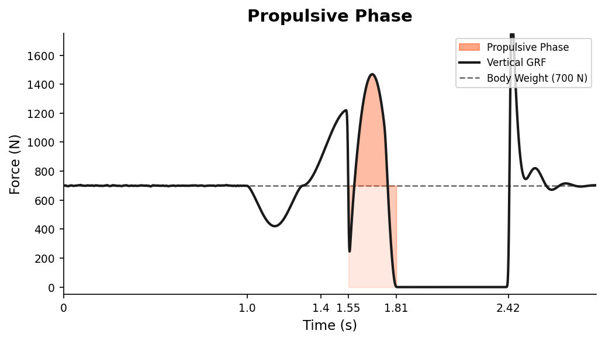 |

---

### Flight Phase

| Description | Force-Time Curve |
|---|---|
| The athlete leaves the force plates from **take-off** until **touchdown**. Flight time is the outcome of every muscle action and generation of momentum. Note: **Jump Height is calculated using takeoff velocity** (industry gold standard), not flight time. | 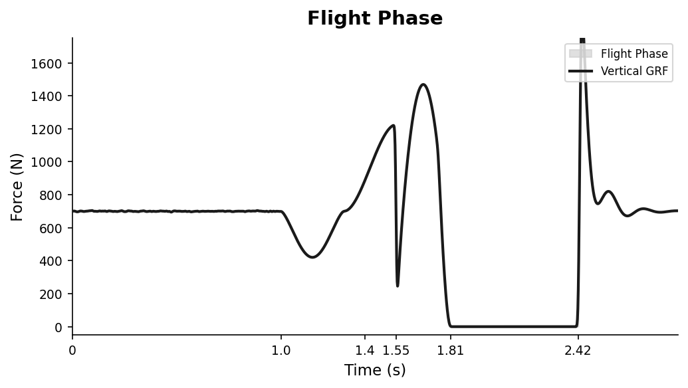 |

---

### Landing Phase

| Description | Force-Time Curve |
|---|---|
| The final CMJ phase. Begins when the athlete **contacts the force plate** after the flight phase. The athlete applies a net impulse equal to the propulsion impulse to decelerate COM from contact velocity through to zero. Bilateral force plates can show discrepancies between limbs — key for **return-to-play** and **injury risk** assessment. | 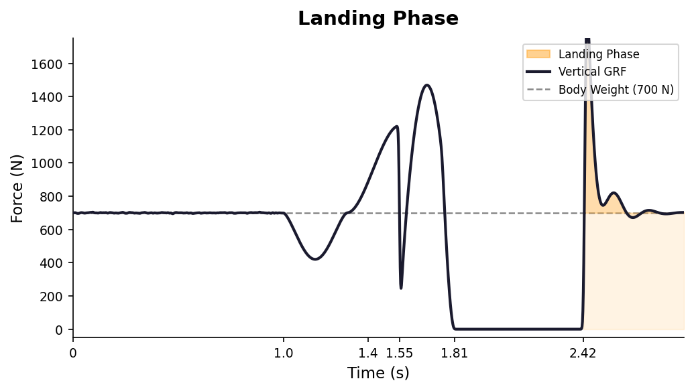 |

---

## Landing Phases — Detail

The CMJ landing curve is subdivided into three distinct phases based on COM velocity and GRF landmarks.

### Full Phase Summary

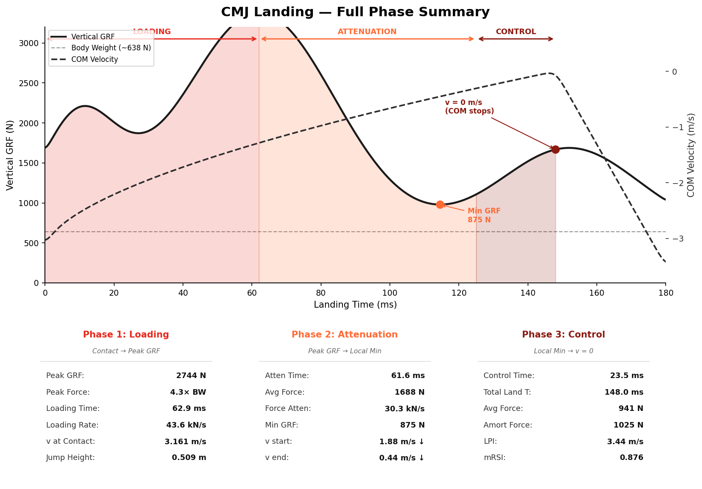

---

### Phase 1: Loading

| Description | Force-Time Curve |
|---|---|
| From **initial contact** to **peak GRF**. The loading rate and peak force reflect how rapidly and forcefully the athlete accepts ground contact. A higher loading rate can increase injury risk. Key metrics: **Peak GRF**, **Loading Rate**, **v at contact**. | 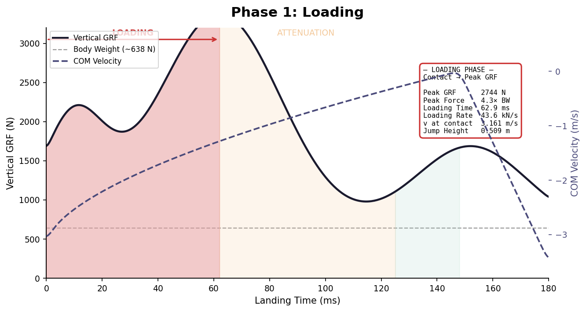 |

---

### Phase 2: Attenuation

| Description | Force-Time Curve |
|---|---|
| From **peak GRF** to the **local minimum**. The athlete is absorbing and attenuating the impact force. The force attenuation rate and average force during this window indicate how efficiently the athlete disperses impact energy through eccentric muscle action. | 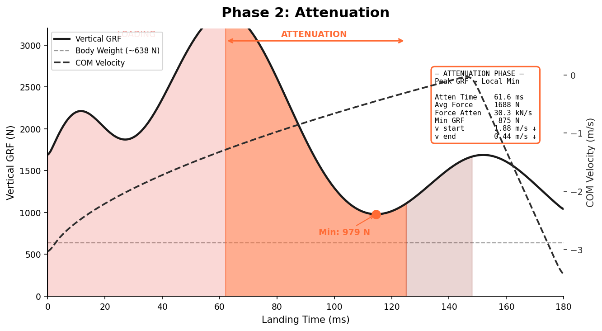 |

---

### Phase 3: Control

| Description | Force-Time Curve |
|---|---|
| From the **local minimum** to when **COM velocity = 0** (COM stops). This brief phase reflects the athlete's ability to stabilize after the main impact is absorbed. Key metrics: **Control Time**, **mRSI**, **LPI**. Shorter control time = greater efficiency. | 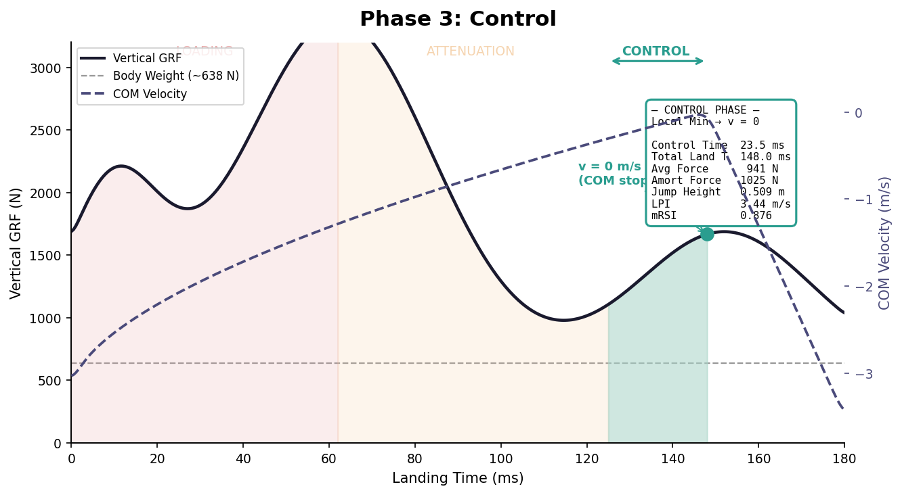 |

---

> **Reference:** McMahon, J. J., Suchomel, T. J., Lake, J. P., & Comfort, P. (2018). Understanding the Key Phases of the Countermovement Jump Force-Time Curve. *Strength & Conditioning Journal, 40*(4), 96–106. https://doi.org/10.1519/ssc.0000000000000375

---

## Individualized Workout Prescription

The CMJ force-time curve is more than a performance metric — it is a **readiness tool**. Each athlete's neuromuscular profile drives a different training prescription. Same assessment system, entirely different outputs.

| CMJ Metric | Prescribes Toward |
|---|---|
| **High RSI + Low Asymmetry (≤5%)** | Speed / Power / Very Heavy loading — neurally demanding sessions |
| **Low RSI + High Asymmetry (≥15%)** | Light / Very Light / Base — unilateral emphasis, return-to-play protocols |
| **High Braking RFD (>4500 N/s)** | Power and speed work — athlete can express force rapidly |
| **Low Braking RFD (<3000 N/s)** | Hypertrophy / Heavy — build capacity before expressing it |
| **Declining Jump Height trend** | Reduce Speed/Power volume, increase recovery sessions |

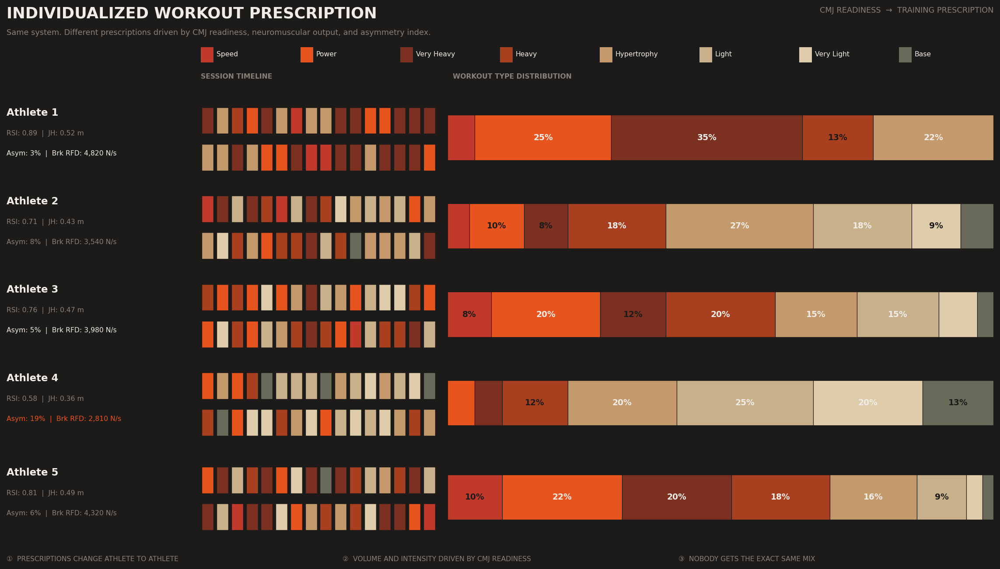

> *5 athletes. 5 different prescription profiles. Nobody gets the exact same mix.*

---

## Sports Performance ML System

A production-grade pipeline connecting force plate assessments to individualized prescriptions at scale. CMJ readiness data flows through Kedro feature engineering pipelines, Prefect orchestration, and MLflow model tracking — from raw sensor output to a real-time prescription dashboard.

| Component | Role |
|---|---|
| **Data Streaming App** | Parses raw `.parquet` from Hawkin Dynamics into structured CMJ phase features |
| **Training Prefect Flow** | Trains Champion / Challenger readiness models via Kedro pipelines |
| **Inference Prefect Flow** | Scores new sessions and outputs individualized workout prescriptions |
| **Monitoring Prefect Flow** | Detects CMJ distribution drift and triggers automatic re-training |
| **Model Registry (MLflow)** | Tracks experiments, stores Champion model, logs metrics per athlete |
| **Prescription Dashboard (Dash)** | Real-time readiness scores and workout outputs for coaches |

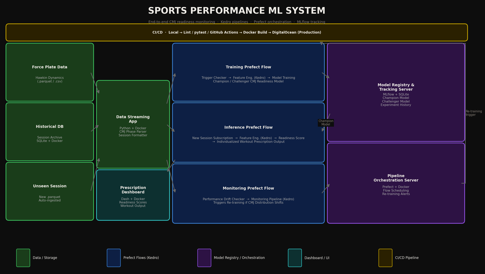

> *CI/CD via GitHub Actions → Docker → DigitalOcean. Fully containerized, reproducible, and observable.*
